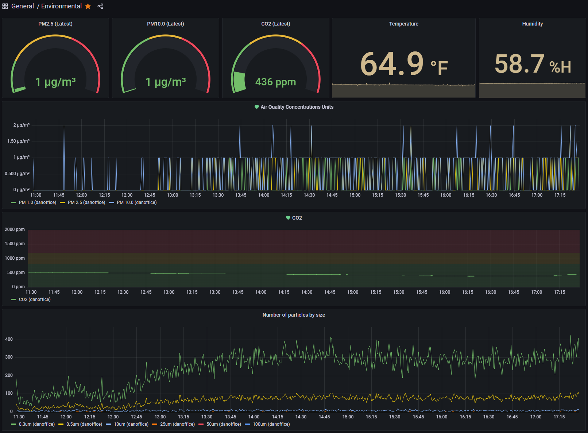

## About
This project uses an ESP8266 loaded with [MicroPython](https://micropython.org/) (v1.17 as of the time of this writing) to collect environmental data from a PMS5003 (particulate matter AKA air quality), DHT22 (temperature and humidity), and MH-Z19C (CO2). It will then periodically send this data to InfluxDB where it can then be graphed with the included Grafana dashboards.



## IMPORTANT Notes
- The PMS5003 only outputs via serial, and the ESP8266 only has a single serial UART which is, by default, used by REPL. I wound up pre-configuring WebREPL before copying code over so I could still connect for debugging and to upload new code. If you do not do so, you may end up with headaches trying to connect to make any changes :-)
- This heavily uses the excellent [PMS5003 library written by Kevin Köck](https://github.com/kevinkk525/pms5003_micropython/) but requires that [this PR](https://github.com/kevinkk525/pms5003_micropython/pull/7) is applied (already included in this repo).
- I ran into memory utilization limitations with the ESP8266 (probably not an issue on the ESP32) and used `mpy-cross` to pre-compile/"freeze" the larger files, especially `pms5003.py`. You can get this tool [here](https://github.com/micropython/micropython/tree/master/mpy-cross).

## Other notes
- While the MH-Z19C supports serial output, I didn't want to deal with juggling with the PMS5003 and ended up using the PWM output (which turned out to be incredibly simple)
- I split out `mainprogram.py` from `main.py` so that you can run `import mainprogram` from WebREPL for debugging purposes
- This calculates rolling averages for PM and CO2 to smooth out any potential spikes
- Per the datasheet, the MH-Z19C can take 24 hours or longer to self-calibrate
- Per the datasheets: the MH-Z19 requires 3.6-5.5V, the MH-Z19B requires 4.5-5.5V, and the MH-Z19C requires **4.9-5.1V**. There are many reports of voltage fluctuations causing significant variance in readings from the B and especially C variants, and I personally experienced this. Find a quality power supply that can output a stable voltage in the required range; I switched from a generic supply to the [official Raspberry Pi micro-USB supply](https://www.raspberrypi.com/products/micro-usb-power-supply/) and my input voltage went from 4.9+/-0.3V to 5.19+/-0.003V.
- Per the `SenseAir S8 0053` (note the **0053**) datasheet it also supports PWM output in the same exact format as the MH-Z19* so you _should_ be able to use them interchangeably, however I have not tested this.
- Grafana supports Alerts to multiple destinations, such as email. You can configure these alerts on the various dashboards to notify you when the values cross a certain threshold, which gives you the additional benefit of notifying you when Influx is no longer receiving data. I put in some fairly aggressive thresholds (compared to what I could find online and via the EPA), but feel free to tweak them as needed.

## How to use
- Install MicroPython on your device
- [Configure wifi](https://docs.micropython.org/en/latest/esp8266/tutorial/network_basics.html)
    ```
    import network
    sta_if = network.WLAN(network.STA_IF)
    sta_if.connect('<your ESSID>', '<your password>')
    ```
- [Configure](https://docs.micropython.org/en/latest/esp8266/quickref.html#webrepl-web-browser-interactive-prompt) _and **test**_ that you can access WebREPL using your tool of choice (CLI, Thonny, [web interface](http://micropython.org/webrepl/), etc)
    ```
    import webrepl_setup
    ```
- Edit `config.py` to your liking
- Pre-compile the larger files, especially `pms5003.py`, with `mpy-cross`
- Using WebREPL, upload everything to the device. If you pre-compiled a file, only upload its `.mpy` file and not the `.py` file. Ie, upload `pms5003.mpy`
- Disconnect from WebREPL and reset your device
- Hopefully at this point your InfluxDB instance (out of scope for this guide) is now receiving data!

## Todo
- Improve error handling, perhaps logging important exceptions somewhere?
- Potentially implement [Watchdog Timers](https://docs.micropython.org/en/latest/library/machine.WDT.html)

## Credits
- [PMS5003 library written by Kevin Köck](https://github.com/kevinkk525/pms5003_micropython/)
- The great folks who develop and maintain MicroPython, as well as their great community support
- Countless StackOverflow posts and Google results!
